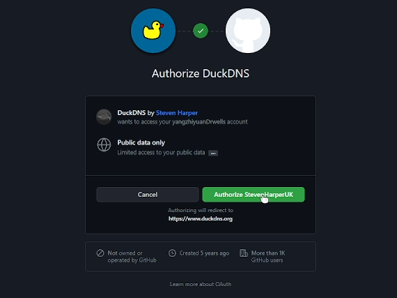
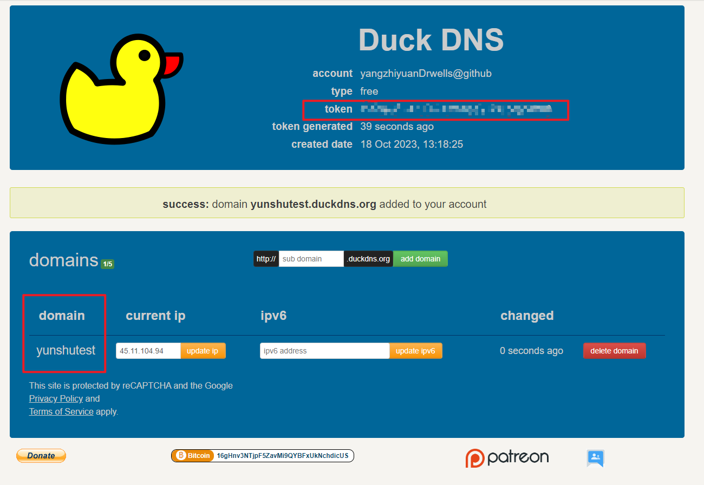
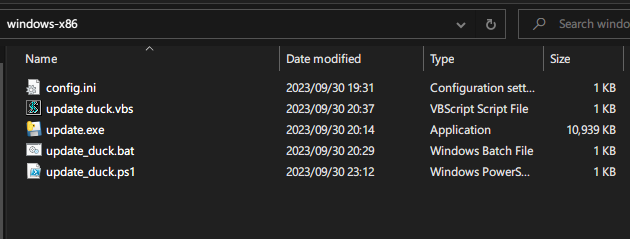
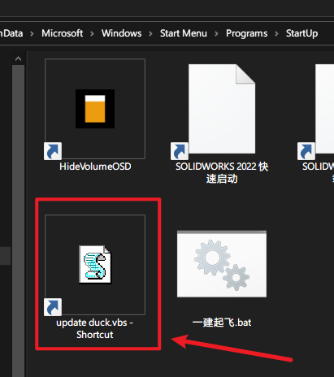

---
 * @Author: Yangzhiyuan
 * @Date: 2022-09-03 23:5:1
 * @Category: 
 * @Filename: 
 * @Summary: 
```math
\KaTeX \space MarkDown \space HTML \space VsCode \space PicGo \space MyEasyPicBedMain \space Prince \hspace{-1cm} \\
```
---
<!-- @import "[TOC]" {cmd="toc" depthFrom=1 depthTo=6 orderedList=false} -->

<!-- code_chunk_output -->

- [项目初衷](#项目初衷)
- [注册一个账号](#注册一个账号)
- [实现细则](#实现细则)
- [使用细则](#使用细则)
  - [windows](#windows)
      - [修改配置文件](#修改配置文件)
      - [修改更新ddns的时间间隔](#修改更新ddns的时间间隔)
      - [启动](#启动)
      - [日志](#日志)
          - [powershell.log如下：](#powershelllog如下)
          - [updateDuckDdns.log如下：](#updateduckddnslog如下)
  - [linux(openwrt)](#linuxopenwrt)
      - [修改update.sh](#修改updatesh)
      - [添加定时任务](#添加定时任务)
      - [查看日志](#查看日志)
      - [设置日志自动清理](#设置日志自动清理)
      - [注意](#注意)
- [自行编译](#自行编译)

<!-- /code_chunk_output -->

# 项目初衷

duckdns免费的ddns确实很香，然而使用起来不是很方便。
duckdns的windows官方软件只支持ipv4。linux中按官方的文档说明，很多时候获取的ipv6并不是公网ipv6，而且当ipv6更新失败时，它就会自动更新ipv4，然而我没有公网ipv4，这回导致域名无法使用。同时按官方的方式更新ip的网络请求很容易失败，因此自己写了一个支持周期性自动更新公网ipv6的项目，同时支持windows和linux，代码已开源。

# 注册一个账号

<a href="https://www.duckdns.org/">https://www.duckdns.org/</a>

可以直接Sign in with GitHub

<p align="center"> <div align="middle"></div></p>

创建一个域名(总共有5个免费域名)


<p align="center"> <div align="middle"></div></p>

记录domain和token


# 实现细则

windows是通过WMI获取到公网ipv6；linux则使用 ifconfig 命令获取 WAN 口信息，然后通过正则表达式匹配带socpe:Glabal标志的ipv6地址，保证获取的ipv6一定是本机的公网ipv6地址

# 使用细则

## windows


下载windows-x86.zip，解压

<p align="center"> <div align="middle"></div></p>

- 我提供的文件分别有以下：
- - config.ini用于提供请求网络的地址，域名和token信息
- - update duck.vbs用于调用批处理任务
- - update_duck.bat用于清理日志文件和执行update_duck.ps1
- - update_duck.ps1创建powershell任务定时执行update.exe更新ddns记录和记录日志

**提供update duck.vbs去调用update_duck.bat批处理，是因为批处理的黑窗很丑，vbs则可以隐藏它执行的批处理程序的窗口**

解压的文件夹随意放置到一个路径中

#### 修改配置文件

修改config.ini

```
[API]
url = https://www.duckdns.org/update
domains = <your domain>
token = <your token>
```

将其中的domins和token都修改成自己在上一步骤记录的


#### 修改更新ddns的时间间隔

只需要update_duck.ps1中 **$interval = 180**变量的值（其单位是秒）


#### 启动


执行update duck.vbs就可以了定时向远程dns服务商更新自己的公网ip

可以每次开机之后手动执行，也可以将update duck.vbs的快捷方式放到C:\ProgramData\Microsoft\Windows\Start Menu\Programs\StartUp路径中，这样程序就会开机之后自动执行

<p align="center"> <div align="middle"></div></p>


#### 日志

程序会回台执行，每次更新完ddns都会追加写入 **powershell.log**和**updateDuckDdns.log**日志

###### powershell.log如下：

```
......
times: 75 - date: 10/18/2023 20:38:56
times: 76 - date: 10/18/2023 20:42:03
times: 77 - date: 10/18/2023 20:45:09
times: 78 - date: 10/18/2023 20:48:14
times: 79 - date: 10/18/2023 20:51:19
times: 80 - date: 10/18/2023 20:54:25
times: 81 - date: 10/18/2023 20:57:30
times: 82 - date: 10/18/2023 21:00:35
......
```

记录了从开机执行到现在的次数及每次执行update.exe完成的时间

###### updateDuckDdns.log如下：

```
2023-10-18 20:57:29,359 - INFO - 发起请求:OK
2023-10-18 20:57:29,360 - INFO - 同步ipv6结束!\\\\\\\\\\\\\\
2023-10-18 21:00:31,188 - INFO - 同步ipv6开始!------------->
2023-10-18 21:00:32,589 - INFO - 通过WMI获取到公网ipv6：240e:358:1158:3d00:d0e9:2ef2:46ae:9792
2023-10-18 21:00:32,590 - INFO - 通过配置文件读取到url:https://www.duckdns.org/update, domains:xxxx, token:xxxx
2023-10-18 21:00:32,594 - DEBUG - Starting new HTTPS connection (1): www.duckdns.org:443
2023-10-18 21:00:34,851 - DEBUG - https://www.duckdns.org:443 "GET /update?domains=wsw10&token=a613170e-c9c5-4615-935e-12f9ea953b56&ipv6=240e%3A358%3A1158%3A3d00%3Ad0e9%3A2ef2%3A46ae%3A9792 HTTP/1.1" 200 None
2023-10-18 21:00:34,853 - DEBUG - Encoding detection: ascii is most likely the one.
2023-10-18 21:00:34,853 - INFO - 发起请求:OK
2023-10-18 21:00:34,854 - INFO - 同步ipv6结束!\\\\\\\\\\\\\\
2023-10-18 21:03:36,324 - INFO - 同步ipv6开始!------------->
2023-10-18 21:03:37,723 - INFO - 通过WMI获取到公网ipv6：240e:358:1158:3d00:d0e9:2ef2:46ae:9792
2023-10-18 21:03:37,724 - INFO - 通过配置文件读取到url:https://www.duckdns.org/update, domains:xxxx, token:xxxx
2023-10-18 21:03:37,728 - DEBUG - Starting new HTTPS connection (1): www.duckdns.org:443
2023-10-18 21:03:39,803 - DEBUG - https://www.duckdns.org:443 "GET /update?domains=wsw10&token=a613170e-c9c5-4615-935e-12f9ea953b56&ipv6=240e%3A358%3A1158%3A3d00%3Ad0e9%3A2ef2%3A46ae%3A9792 HTTP/1.1" 200 None
2023-10-18 21:03:39,806 - DEBUG - Encoding detection: ascii is most likely the one.
2023-10-18 21:03:39,806 - INFO - 发起请求:OK
2023-10-18 21:03:39,806 - INFO - 同步ipv6结束!\\\\\\\\\\\\\\
```

信息更加详细，记录了：获取到的公网ipv6地址，配置文件读取状态，发起请求的执行结果等

## linux(openwrt)

将**get_ipv6_re.sh**和**update.sh**放到同一个路径中，然后借助crontab定时任务和logrotate日志管理工具实现openwrt只要开机就会自动执行的效果

#### 修改update.sh

```
#!/bin/sh
ipv6_address=$(/duckdns/get_ipv6_re.sh)
echo "$ipv6_address"
# 输出获取的 IPv6 地址
# echo "$ipv6_address" >> /duckdns/updatelog.log 2>&1
echo url="https://www.duckdns.org/update?domains=xxxx&token=xxxxxxxx-c9c5-4615-935e-12f9ea953b58&ipv6=$ipv6_address" | curl -k -o /duckdns/duck.log -K -
```
将最后一行url中的domains和token修改成自己的

#### 添加定时任务

```
chmod 777 update.sh  # 改变脚本权限

crontab -e  # 添加定时任务
*/1 * * * * /duckdns/update.sh >> /duckdns/updatelog.log 2>&1  # 添加一行定时任务(每1分钟更新一次)

grep CRON /var/log/*  # 查看cron日志
```

**1表示一分钟更新一次，按照自己的需要修改（如果你的ipv6经常改变，可以保持1），建议时间间隔长一些，因为可能存在请求失败的情况，duckdns服务商在你请求ipv6失败的时候可能会检索你的ipv4自动并自动更新记录，而域名解析的时候是优先解析ipv4的，如果你只使用ipv6，这样会导致你的域名无法正常访问你的设备**

**要是你的域名无法正常使用，请登录duckdns，查看ipv4记录是否为空**

#### 查看日志

updatelog.log

```
240e:368:1000:69f7:b84c:d1de:8a8b:c82d
  % Total    % Received % Xferd  Average Speed   Time    Time     Time  Current
                                 Dload  Upload   Total   Spent    Left  Speed
100     2    0     2    0     0      0      0 --:--:--  0:00:04 --:--:--     0
240e:368:1000:69f7:b84c:d1de:8a8b:c82d
  % Total    % Received % Xferd  Average Speed   Time    Time     Time  Current
                                 Dload  Upload   Total   Spent    Left  Speed
100     2    0     2    0     0      0      0 --:--:--  0:00:04 --:--:--     0
```

linux下的日志就简单粗暴得多


#### 设置日志自动清理

updatelog.log每分钟都会多一行，最后会导致日志文件过大，因此使用logrotate工具自动清理，策略是每满10行就开始清理

1. 打开`logrotate`的配置文件以编辑：

```bash
vi /etc/logrotate.conf
```

2. 在配置文件中添加一个新的日志文件条目，用于指定您要进行轮换和清理的日志文件以及相关配置。例如，如果您的日志文件是`/path/to/your/log.log`，以下是一个示例配置：

```bash
/duckdns/updatelog.log {
size 10
rotate 1
copytruncate
compress
delaycompress
missingok
notifempty
}
```


这个配置指定了以下内容：

- `size 10`：当日志文件大小达到10字节时触发轮换和清理。
- `rotate 2`：保留2个轮换后的日志文件。
- `copytruncate`：在轮换时创建新的日志文件，但不截断原始日志文件。这可以避免中断正在写入的进程。
- `compress`：使用gzip进行压缩，将轮换后的日志文件保存为`.gz`文件。
- `delaycompress`：延迟压缩，保留一个未压缩的备份。
- `missingok`：如果日志文件不存在，不生成错误。
- `notifempty`：如果日志文件为空，不进行轮换。

3. 保存并退出编辑器。

4. 运行`logrotate`手动执行配置：

```bash
logrotate -f /etc/logrotate.conf
```


#### 注意

**duckdns有一个机制，请求的url不给定任何ip参数或者更新ipv6失败时，duckdns服务商则会默认检索本机的ipv4地址并更新**如果发现自己的域名无法正常解析ipv6，则去duck.org将自己的域名ipv4给空，只留ipv6记录，然后更新就好了。


# 自行编译

**requirtment.txt**

```
wmi
requests
logging
configparser
```
> pip速度慢，指定源：
> -i https://pypi.tuna.tsinghua.edu.cn/simple/

**windows**

```
pip install update pyinstaller
pyinstaller --onefile --noconsole getip.py
```
**已测试的环境Python==3.9.0**

**更新的python版本可能会导致：win32ctypes.pywin32.pywintypes.error: (225, 'EndUpdateResourceW', 'Operation did not complete successfully because the file contains a virus or potentially unwanted software.')**

**Linux**

无需编译，提供了sh脚本
